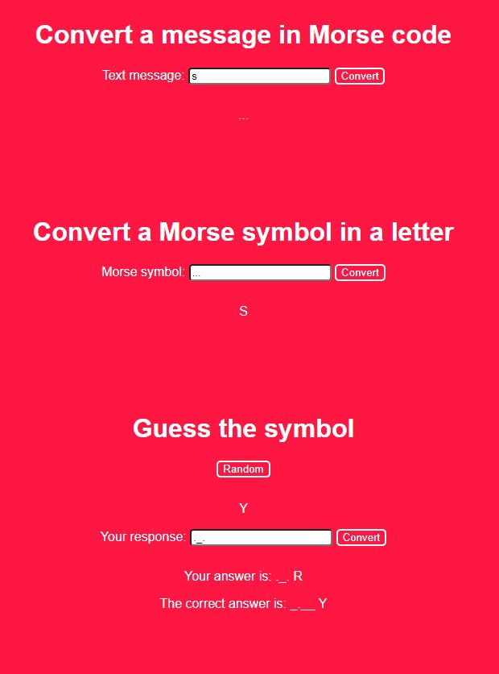

# Morse-webapp

[](https://app.netlify.com/sites/youthful-davinci-968447/deploys)

Learn and play:
> https://youthful-davinci-968447.netlify.app/

## Develope
Install node modules ```npm install``` and build the application ```webpack```

